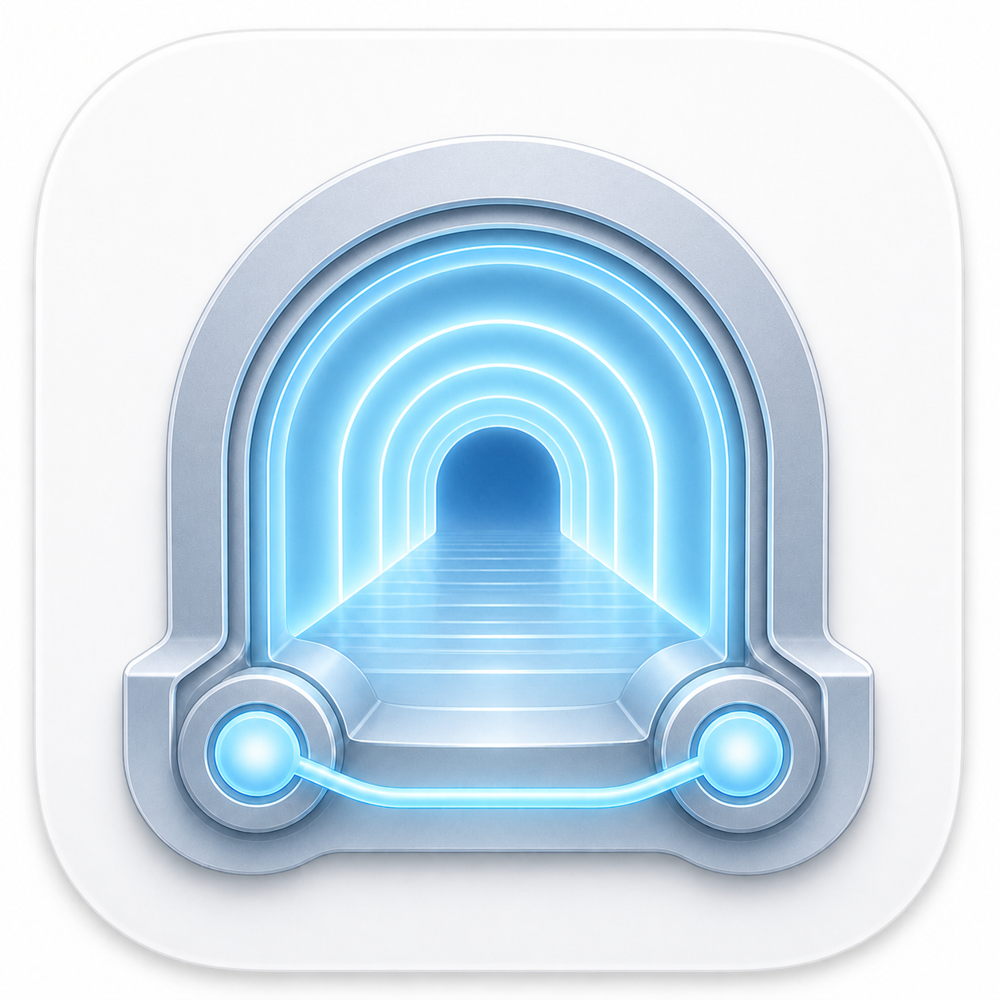

# TunnelDock

> 原生 macOS OpenSSH 本地端口转发管理器。

简体中文 | [English](README.en.md)

TunnelDock 会从现有的 `~/.ssh/config` 发现可连接的主机，让你通过图形界面快速建立本地 SSH 隧道。它是系统 OpenSSH 的图形化管理工具，并不自行实现 SSH 协议。



## 功能

- **SSH 配置发现**：读取 `~/.ssh/config`，并递归处理 `Include` 指令，包括相对路径和通配符模式；只列出可连接且显式声明的主机别名。
- **快速添加 Host**：可从侧栏追加一个新的 Host 配置；不会修改或删除既有 SSH 配置，也可交由默认编辑器直接编辑 `~/.ssh/config`。
- **快速转发**：选择主机、输入远端端口并连接。默认创建 `127.0.0.1:<端口>` → `<主机>:127.0.0.1:<端口>` 的转发。
- **最近使用的隧道**：成功连接的快速转发会自动保存；断开后可重命名、编辑、重新连接或删除。
- **独立连接**：每条隧道使用独立的 OpenSSH 控制套接字和生命周期，可同时独立运行。
- **菜单栏与 Dock**：应用保留为普通 Dock 应用，也可选择在菜单栏中显示已保存的隧道。
- **连接恢复**：已建立的连接中断后会采用有上限的退避策略重试；界面会显示连接状态和每条隧道的日志。
- **在浏览器中打开**：隧道连接后，可按 HTTP 或 HTTPS 协议打开本地地址。

## 环境要求

- macOS 13 Ventura 或更高版本
- 包含 Swift Package Manager 的 Swift Command Line Tools
- 可用的系统 OpenSSH 客户端：`/usr/bin/ssh`

无需安装 Xcode。项目只使用 SwiftPM，且不提供 `.xcodeproj`。

## 快速开始

在仓库根目录执行以下命令，构建本地签名的 `.app`：

```sh
sh Scripts/package-app.sh
```

构建出的通用二进制应用位于：

```text
.build/release/TunnelDock.app
```

可从 Finder 打开，或执行：

```sh
open .build/release/TunnelDock.app
```

### 创建隧道

1. 在 `~/.ssh/config` 中定义主机，例如：

   ```ssh-config
   Host gpu-server
       HostName gpu.example.com
       User alice
       Port 22
   ```

2. 打开 TunnelDock，然后在侧栏中选择 **gpu-server**。
3. 在 **快速转发** 中输入远端端口（例如 `8888`），然后点击 **连接**。
4. 隧道连通后，访问本机 `http://127.0.0.1:8888`，或点击 **在浏览器中打开**。

也可以点击 Host 列表工具栏中的 **+**，在应用内快速追加一个 Host。只需填写 HostName；Host 默认使用 HostName，User 默认是当前登录用户，Port 默认为 22。旁边的编辑按钮会用 macOS 默认编辑器打开 `~/.ssh/config`。

可通过 **高级设置** 修改本地端口、远端主机、本地监听地址，以及 **在浏览器中打开** 使用的 HTTP/HTTPS 协议；这些选项不会改变 SSH 转发本身的语义。

## 安全与隐私

- TunnelDock 通过 `Process` 调用 `/usr/bin/ssh`，不经由 shell，也不会自行实现 SSH 协议。
- 不会保存 SSH 密码、私钥口令、私钥、`known_hosts`、进程 ID、控制套接字或运行日志。
- SSH 使用批处理模式并保持严格的主机密钥校验；未知或变更的主机密钥不会被自动接受。
- 仅已保存的隧道定义会写入 `~/Library/Application Support/TunnelDock/saved-tunnels.json`。

## 开发

运行无第三方依赖的可执行测试套件：

```sh
sh Scripts/test.sh
```

构建应用后，运行打包检查：

```sh
sh Scripts/package-app.sh
sh Tests/Packaging/package-app-tests.sh
```

脚本会优先选择 Command Line Tools SDK，并把 SwiftPM 与 Clang 的构建缓存保留在 `.build/` 中，因此不需要全局 Xcode 安装或额外的缓存配置。

## 项目结构

```text
Sources/TunnelDockCore/       SSH 配置、持久化和隧道生命周期
Sources/TunnelDockAppSupport/ 面向界面的应用状态和辅助功能
Sources/TunnelDock/           SwiftUI 与 AppKit 应用界面
Resources/                    应用元数据和图标资源
Scripts/                      测试、图标生成和应用打包脚本
Tests/                        无第三方依赖的可执行测试和打包测试
docs/                         产品规格与手动验收清单
```

## 当前限制

- TunnelDock 聚焦于本地端口转发，并非完整 OpenSSH 命令行功能的替代品。
- v1 只读取用户 SSH 配置及其 `Include` 文件，不支持自定义 `ssh -F` 配置来源或多配置档案。
- 应用在 Mac App Store 之外分发，不包含登录项或系统通知。
- 进行手动验收时请使用可丢弃的 SSH 测试环境，避免使用生产主机或凭据。

## 文档

- [产品与技术规格](docs/TunnelDock%20v1.0%20Product%20%26%20Technical%20Specification.md)
- [手动验收清单](docs/manual-acceptance-checklist.md)
- [Windows 原生实现](Windows/README.md)
